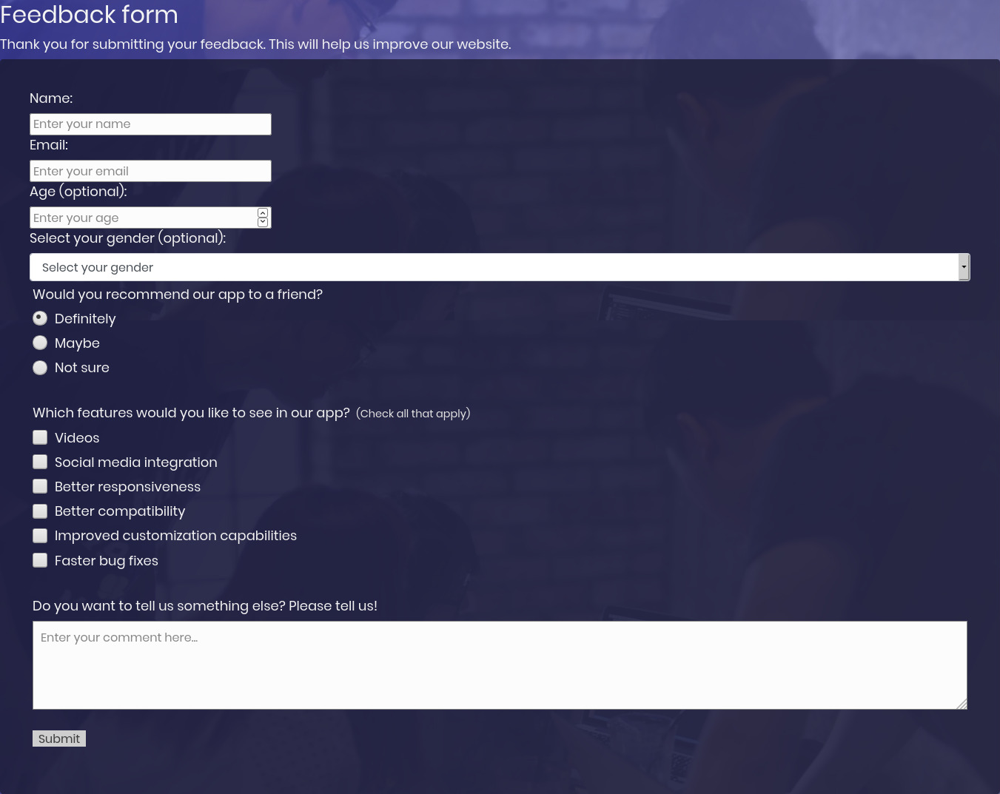

# Responsive Web Design: Survey form

> Welcome my project "Responsive Web Design: Survey form" , built with html and css. 
The purpose of this exercise is to make use of responsive web design principles in order to make the website responsive. In particular, media queries are used to adapt the content to different viewport sizes.
Please enjoy and leave a comment.

# Screenshot

## Live Demo
[Live Demo Link](https://rawcdn.githack.com/alvarorf/FCC-ResponsiveWebDesign-surveyForm/98129075a69f56aae54e8276ee0af8beff950606/index.html)

## Getting Started

Simply download the zip and decompress. Once decompressed, double click or open index.html in any web browser. 

## Authors

👤 **Alvaro Ruiz**

- Github: [@alvarorf](https://github.com/alvarorf)
- Twitter: [@aaruizf](https://twitter.com/aaruizf)
- Linkedin: [linkedin](https://www.linkedin.com/in/alvaro-r-22810915a/)

## 📝 License

This project is for Freecodecamp's curriculum purposes.
